# 1. Github 로그인

1. https://github.com/login
2. 로그인

# 2. 미니멀미스테이크 포크

1. https://github.com/mmistakes/minimal-mistakes
2. 우상단 Fork클릭하여 Fork 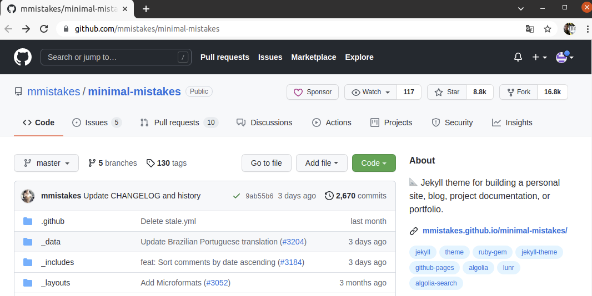
3. 내 레파지토리에 확인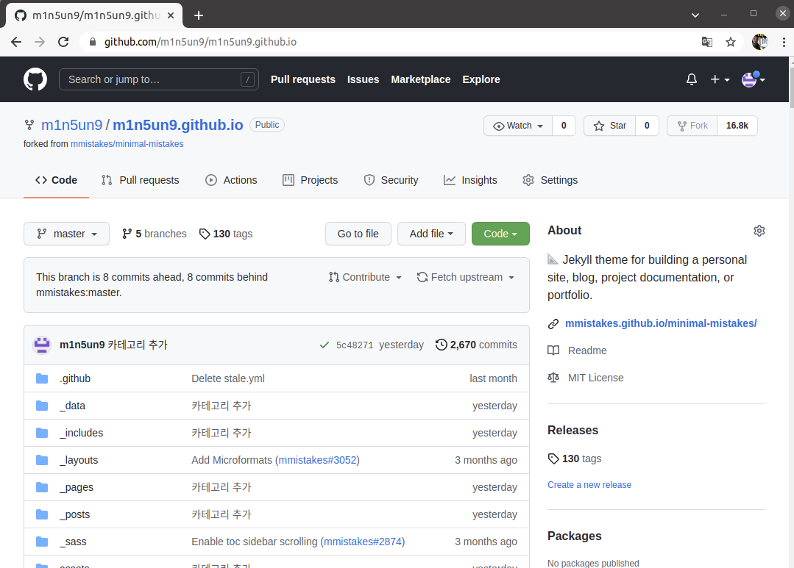
4. 우측 중간에 Setting 클릭하고 Repository name을 `[git계정명].github.io` 로 변경

# 3. Github Desktop 설치

1. 윈도우, 맥OS => https://desktop.github.com/

2. 리눅스 (Ubuntu)

   ```shell
   wget -qO - https://packagecloud.io/shiftkey/desktop/gpgkey | sudo tee /etc/apt/trusted.gpg.d/shiftkey-desktop.asc > /dev/null
   sudo sh -c 'echo "deb [arch=amd64] https://packagecloud.io/shiftkey/desktop/any/ any main" > /etc/apt/sources.list.d/packagecloud-shiftkey-desktop.list'
   sudo apt-get update
   ```

   

3. 실행후 로그인,

4. 초기화면에서 Your repositories => [깃허브유저명]/[깃허브유저명].github.io 선택 => Clone!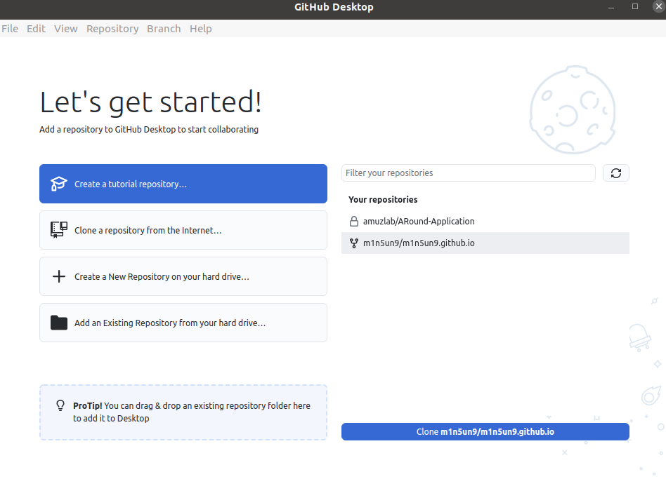

5. 내 프로젝트만 쓰겠다는 옵션 체크하면 끝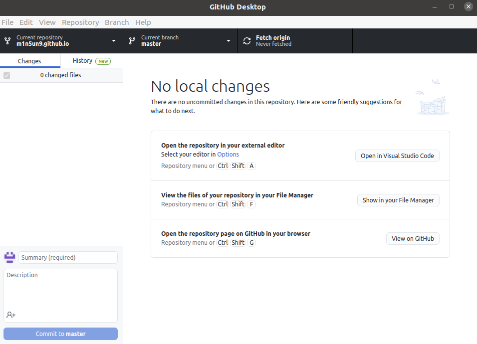

# 4. Visual Studio Code 설치

1. https://code.visualstudio.com/download
2. [파일]-[폴더열기]-앞에서 clone한 폴더 선택

# 5. Typora 설치

1. https://typora.io/ => Download
2. 이미지 설정 : 파일=>환경설정=>이미지 => 체크박스 아래 그림과 같이 체크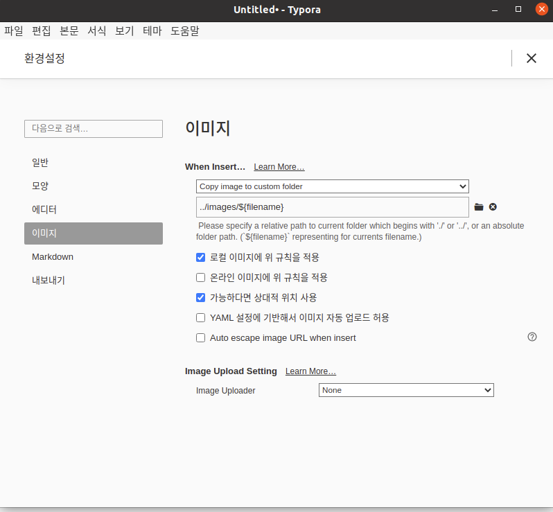

3. [파일]-[폴더열기]-[클론한 폴더/_posts]선택 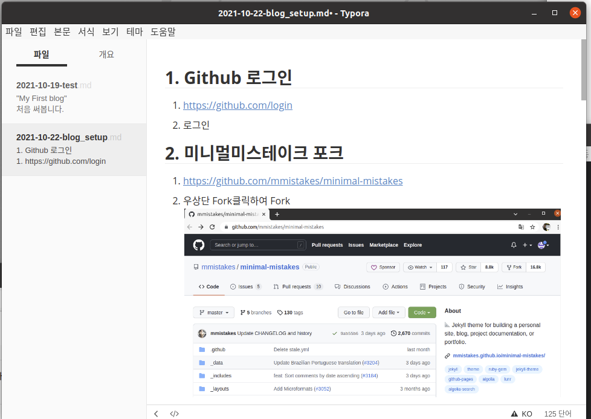


# 6. 작성하기

1. typora에서 `날짜명-그외적을말.md` 로 저장

2. Github desktop에서 `commit to master`=> `push origin`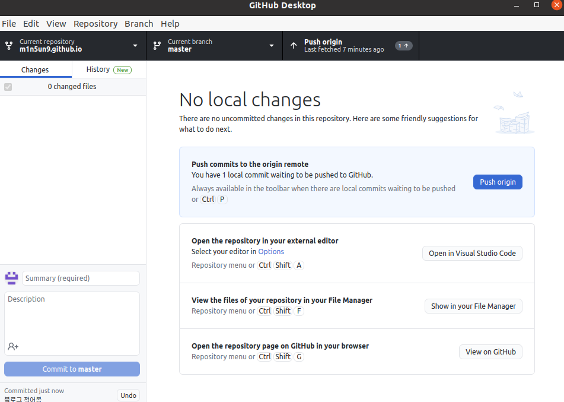

   

# 7. 로컬 서버 셋팅

윈도우나 MacOS는 우측 링크 참고 https://jekyllrb.com/docs/installation/  

(아래는 우분투 기준)

1. 루비설치

   ```sh
   sudo apt-get install ruby-full build-essential zlib1g-dev
   ```

2. ~/.bashrc에 gem관련 추가

       ```sh
       echo '# Install Ruby Gems to ~/gems' >> ~/.bashrc
       echo 'export GEM_HOME="$HOME/gems"' >> ~/.bashrc
       echo 'export PATH="$HOME/gems/bin:$PATH"' >> ~/.bashrc
       source ~/.bashrc
       ```

3. Jekyll and Bundler 설치

    ```sh
    gem install jekyll bundler
    ```

4. 클론했던 폴더로 이동

   ```sh
   cd ~/m1n5un9.github.io
   ```

   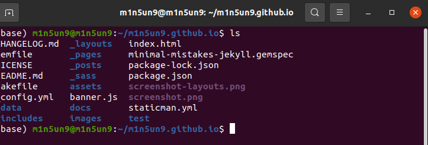

5. bundle설치 및 구동

   ```sh
   bundle install
   bundle add webrick
   bundle exec jekyll serve
   ```

6. 브라우저 열어서 `localhost:4000` 열기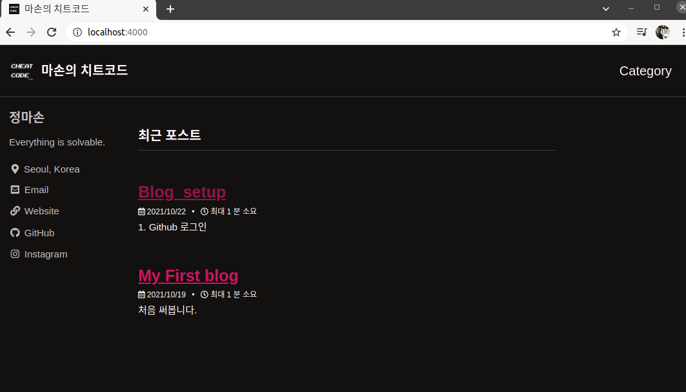


# 8. 블로그 설정

## A. 테마 변경

1. VS Code에서 _config.yml파일의 minimal_mistakes_skin 변경

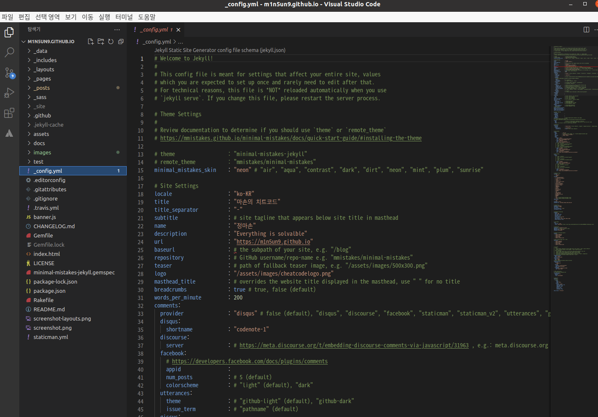

2. 그외 설정 변경

```yaml
minimal_mistakes_skin    : "neon" # "air", "aqua", "contrast", "dark", "dirt", "neon", "mint", "plum", "sunrise"

# Site Settings
locale                   : "ko-KR"
title                    : "마손의 치트코드"
title_separator          : "-"
subtitle                 : # site tagline that appears below site title in masthead
name                     : "정마손"
description              : "Everything is solvalble"
url                      : "https://m1n5un9.github.io"
baseurl                  : # the subpath of your site, e.g. "/blog"
repository               : # GitHub username/repo-name e.g. "mmistakes/minimal-mistakes"
teaser                   : # path of fallback teaser image, e.g. "/assets/images/500x300.png" 
logo                     : "/assets/images/cheatcodelogo.png"
masthead_title           : # overrides the website title displayed in the masthead, use " " for no title
breadcrumbs              : true # true, false (default)
```

! 설정변경은 서버 재구동 해야 확인 가능


## B. 카테고리 설정

_config.ymldml - category_archive, jekyll-archives 주석해제

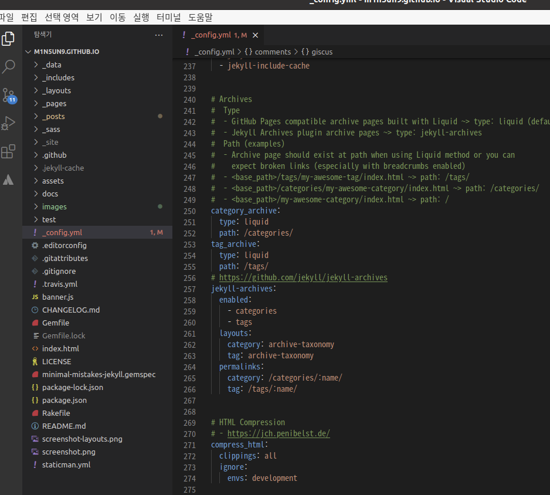

_pages/category-archive.md파일 생성 후 아래 내용작성

```markdown
---
title: "Category"
layout: categories
permalink: /categories/
author_profile: true
sidebar_main: true
---
```

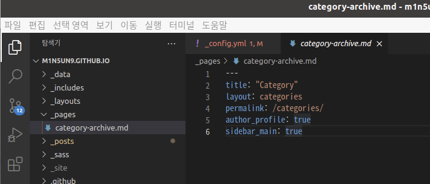

_data/navigation.yml수정

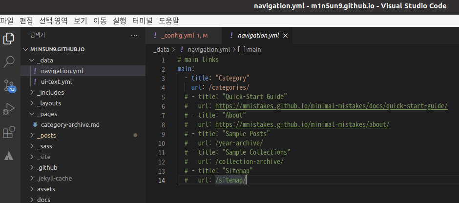

 게시물 상단에 카테고리 지정

```markdown
---
layout: single
title : Github.io 블로그 설정 A to Z
categories: Blog
---
```

서버 우측 Category 클릭하면 이렇게 게시물 카테고리별로 나옴

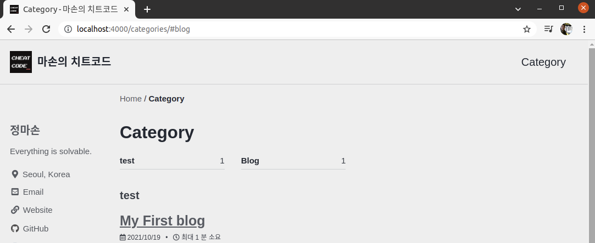


* **주의**

  카테고리 설정후에 _post폴더 아래에 카테고리별로 하위폴더를 만들어서 게시글을 작성하자, 그리고 typora의 이미지 파일 저장 설정을 ../images에서 ../../images로 변경해주자

  웹에 게시될때 카테고리에따라 URL경로가 하나 더생겨서 typora와 웹상의 이미지의 경로차이가 발생하기 때문에 실제 저장경로또한 한단계 하단으로 내려주는 것이다.


## C. 태그 추가

_pages/tag-archive.md파일 추가하고 아래 내용 작성

```markdown
---
title: "Tag"
layout: tags
permalink: /tags/
author_profile: true
sidebar_main: true
---
```

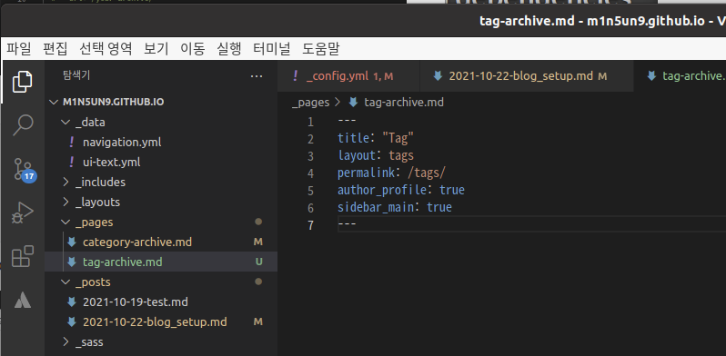

_data/navigation.yml에 아래와 같이 추가

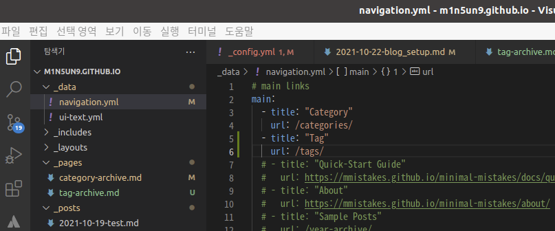

게시물에 상단에 Tag정보 추가

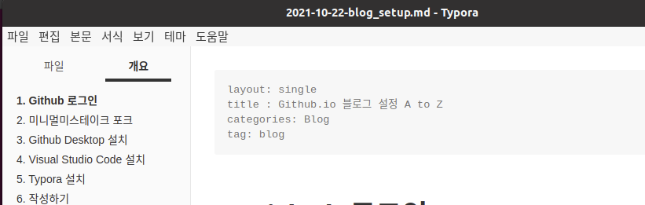

서버 재구동후 메뉴 에 Tag 추가됨

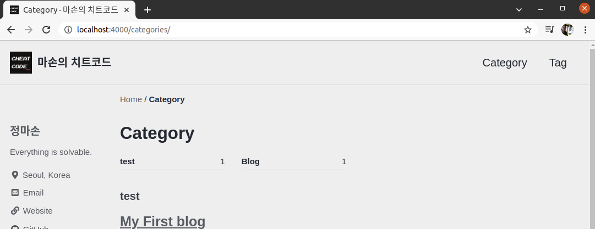

게시물에도 내용 추가됨

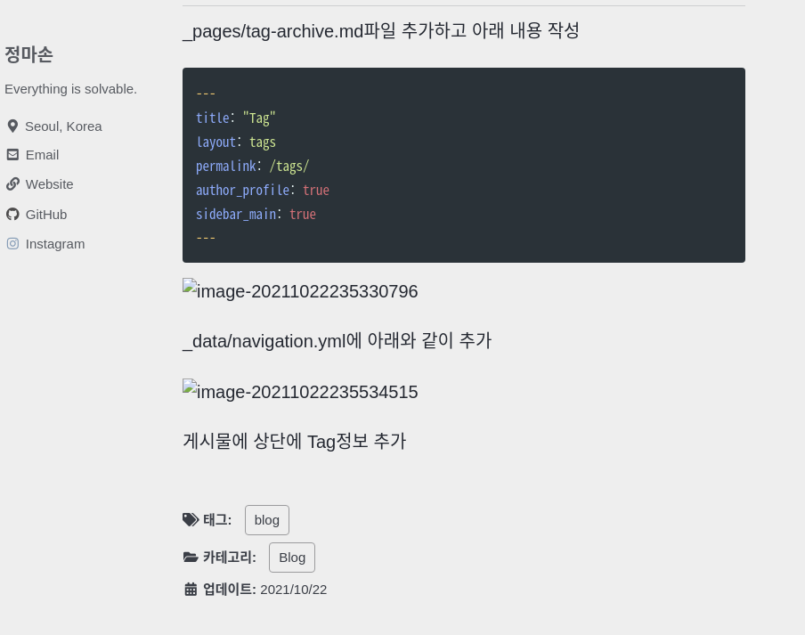

태그 여러개 달때는 대괄호로 감싸고 콤마로 구분하여 작성 ex `[blog, github, something]`

## D. 검색 설정

