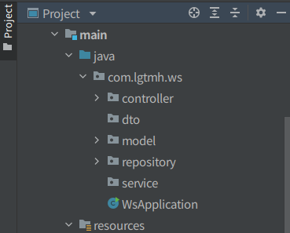

# 1. build.gradle에 아래 Dependency 추가

```groovy
implementation 'org.springframework.boot:spring-boot-starter-data-jpa'
runtimeOnly 'mysql:mysql-connector-java'
```

# 2. mysql 접속정보 설정

src/main/resources/application.properties 파일에 아래와 같이 작성

```properties
spring.jpa.database=mysql
spring.jpa.hibernate.ddl-auto=update
spring.datasource.url=jdbc:mysql://127.0.0.1:3306/lgtmh?characterEncoding=utf8
spring.datasource.username=root
spring.datasource.password=password
spring.datasource.driver-class-name=com.mysql.cj.jdbc.Driver
spring.jpa.show-sql=true
```

# 3. 소스 구조 만들기

src/main/java/[패키지명]하위폴더에

Model, Repository, Controller, Service, Dto패키지(폴더) 생성



# 4. Model 코드 작성

```java
```


# 5. Repository 작성

```java

```


# 6. Controller 작성

```java
```


*Service와 DTO는 향후 필요에 따라 작성*


# 7. Swagger ui 로 테스트


# 8. DB확인


