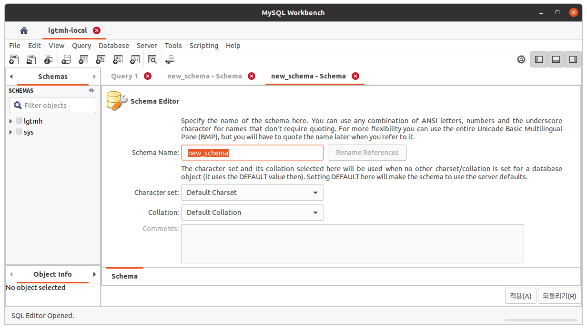

# 0. (도커없으면) 도커 설치

```shell
sudo apt install docker.io
```

# 1. Mysql 이미지 다운로드

```shell
sudo docker pull mysql:5.7
```

# 2. 이미지 확인

```shell
(base) m1n5un9@m1n5un9:~$ sudo docker images
REPOSITORY   TAG       IMAGE ID       CREATED       SIZE
mysql        5.7       938b57d64674   3 weeks ago   448MB
(base) m1n5un9@m1n5un9:~$ 
```


# 3. 도커 컨테이너실행

``` shell
sudo docker run -d -p 3306:3306 -e MYSQL_ROOT_PASSWORD=password --name mysql-ws -v /home/m1n5un9/db:/var/lib/mysql mysql:5.7 --character-set-server=utf8mb4 --collation-server=utf8mb4_unicode_ci
```

# 4. Workbench에서 확인


# 5. 사용할 DB Schema 생성

- SCHEMAS아래에 우클릭하여 Create Schema클릭
- Schema Name에 사용할 스키마 명 적고, 적용버튼 클릭



