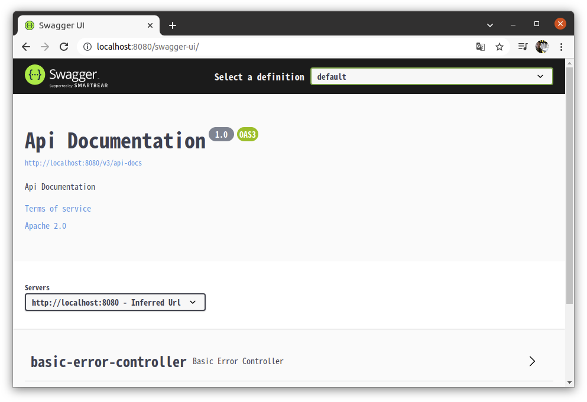

# 1. build.gradle에 의존성 추가

```properties
implementation 'io.springfox:springfox-boot-starter:3.0.0'
```


# 2. 브라우저에서 확인

1. Spring Boot Application 실행
   - main/java/패키지명/프로젝트명Applicatoin.java파일 우클릭
   - Run
2. 브라우저 켜고 http://localhost/8080/swagger-ui/

