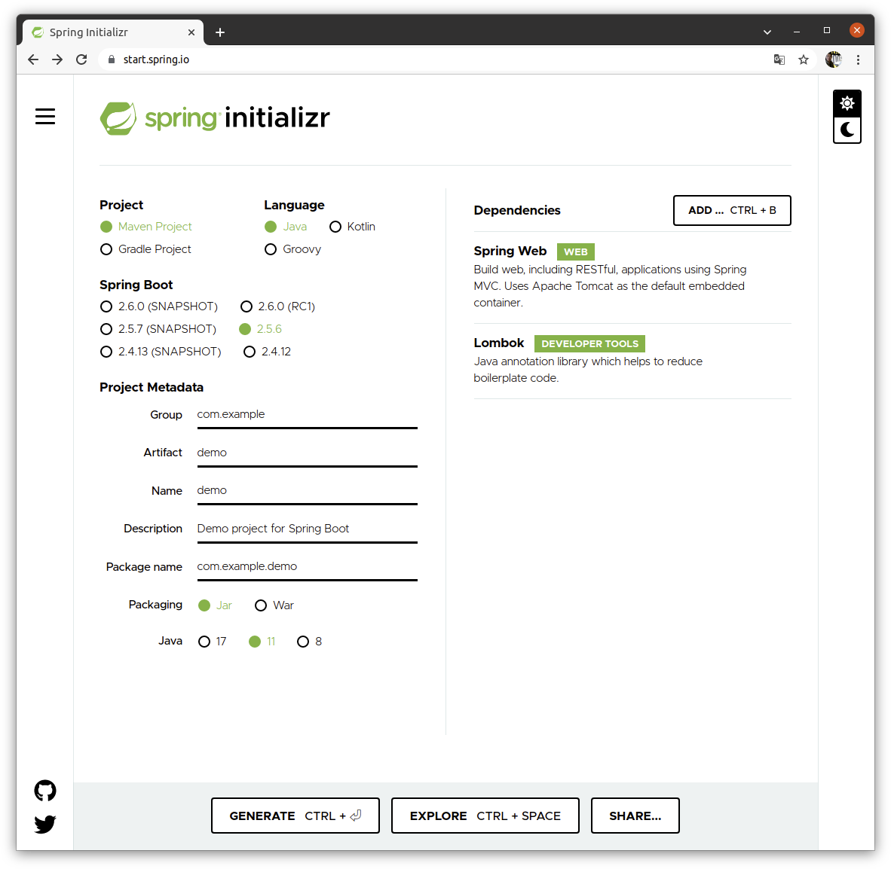
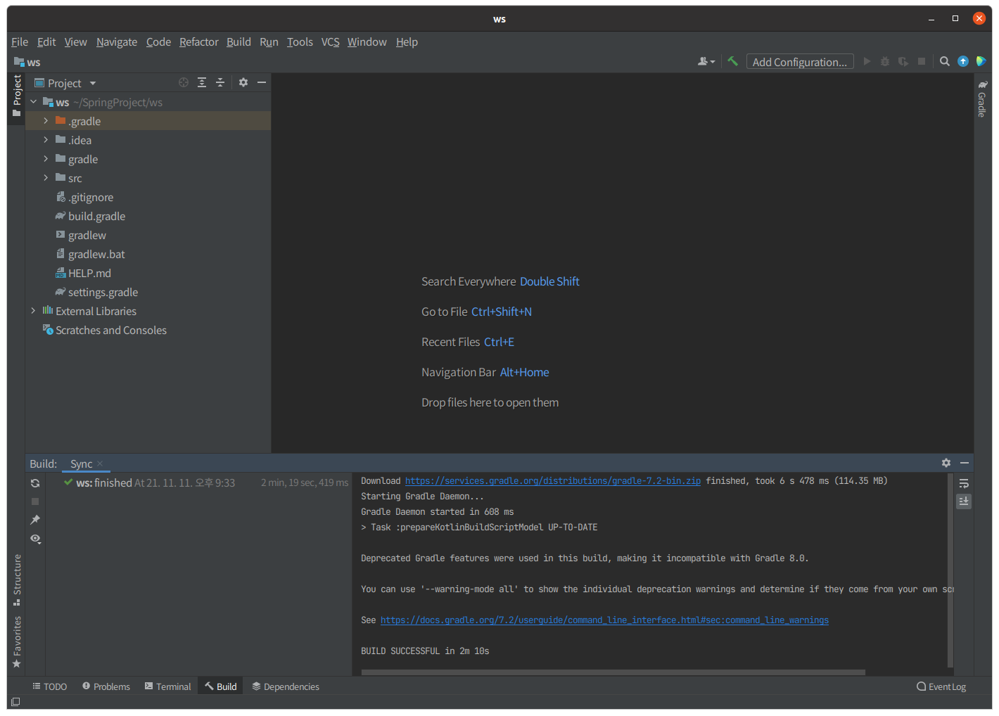
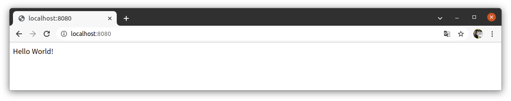

# 1. Spring Initializr통해 프로젝트 생성

1. start.spring.io접속

2. Gradle, java 선택

3. 우측 Dependencies에서 필요 디펜던시 선택

4. Generate선택해서 다운로드

5. 적절한 위치에 압축 품

   

# 2. IntelliJ Idea Community로 폴더 열고 Gradle sync



# 3. 구동확인을 위한 Hello World Controller 구현

1. src/main/java/[패키지명]/controller 폴더생성

2. HelloContorller.java생성

3. 단순 HelloWorld String 출력하는 컨트롤러 작성

   ```java
   package com.lgtmh.ws;
   
   import org.springframework.web.bind.annotation.RequestMapping;
   import org.springframework.web.bind.annotation.RestController;
   
   @RestController
   public class HelloWorld {
       @RequestMapping("/")
       public String helloWorld(){
           return "Hello World!";
       }
   }
   
   ```
   
   

# 4. 실행후 브라우저 확인



